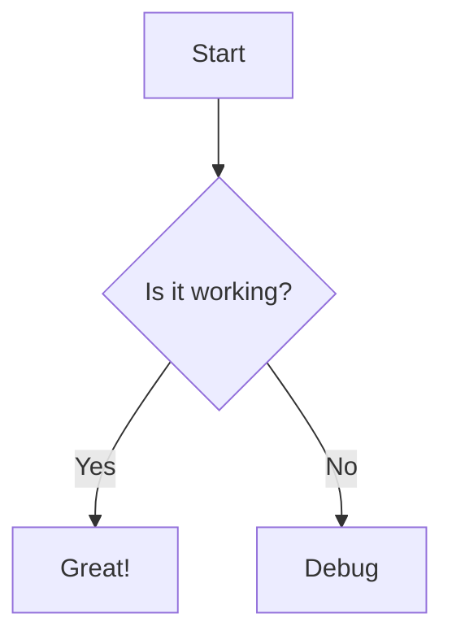

# em2f README

This VS Code Plugin exports Mermaid graphs to files like svg, png, pdf...

## Features

- Export Mermaid diagrams to multiple formats (SVG, PNG, PDF)
- Multiple themes support
- Configurable PNG export settings
- High-quality PDF export with proper scaling
- Easy access via editor title bar, context menu, or command palette
- Support for custom output directories

## Requirements

- VS Code
- Node.js and npm
- Mermaid
- Google Chrome or Microsoft Edge (for PDF export)

## Installation

Install from VS Code extensions or .vsix file

## Usage

ExportMermaid2File allows you to export Mermaid diagrams from your Markdown files to various formats (SVG, PNG, PDF). Here are the different ways to use it:

### Quick Export
1. Open a Markdown file containing a Mermaid diagram
2. Click the export icon in the editor title bar (appears when viewing markdown files)
3. Select your desired output format (SVG, PNG, or PDF)
4. Enter the desired output filename
5. Your diagram will be exported in the selected format

### Context Menu Export
1. Right-click anywhere in a Markdown file
2. Select "Export Mermaid Diagram" from the context menu
3. Select your desired output format
4. Enter the desired output filename
5. Your diagram will be exported using current settings

### Command Palette
1. Open the Command Palette (Ctrl+Shift+P / Cmd+Shift+P)
2. Type "Export Mermaid Diagram"
3. Press Enter
4. Select your desired output format
5. Enter the desired output filename

### Export Settings
Configure the extension in VS Code settings:

* `em2f.outputType`: Choose output format
  - `svg` (default) - Vector graphics, best for web and scaling
  - `png` - Bitmap image, good for presentations
  - `pdf` - PDF document, ideal for printing with perfect scaling

* `em2f.theme`: Select diagram theme
  - `default` - Standard Mermaid theme
  - `forest` - Green-focused nature theme
  - `dark` - Dark background theme
  - `neutral` - Minimal black and white theme

* `em2f.pngScale`: Set PNG resolution (1 = 100%)
  - Range: 0.1 to 10
  - Higher values create larger, higher resolution images
  - Default: 1

* `em2f.pngBackground`: Set background color for PNG exports
  - Use color names ('white', 'transparent') or hex codes (#FFFFFF)
  - Default: 'white'

* `em2f.outputDirectory`: Set default output directory
  - Absolute path or relative to workspace
  - Leave empty to use source file location

### Example Diagram
````markdown

````

### Notes
- The exported file will be saved in the same directory as your Markdown file (unless outputDirectory is set)
- If a file with the same name exists, it will be overwritten
- The extension requires Node.js and npm to be installed on your system
- For PNG exports, consider using `pngScale` > 1 for high-DPI displays
- For PDF exports, Google Chrome or Microsoft Edge must be installed
- PDF export maintains perfect scaling and vector quality

## Extension Settings

ExportMermaid2File can be configured through VS Code's settings. You can access these by:
- Opening Command Palette (Ctrl+Shift+P / Cmd+Shift+P)
- Typing "Settings"
- Selecting "Preferences: Open Settings (UI)"
- Searching for "Export Mermaid 2 File" or "em2f"

### Available Settings

#### Output Type (`em2f.outputType`)
Controls the format of the exported diagram.
* `svg` (default)
  - Scalable Vector Graphics format
  - Best for web use and responsive design
  - Maintains quality at any size
  - Smallest file size for simple diagrams
  - Can be edited with vector graphics software

* `png`
  - Bitmap image format
  - Good for presentations and documents
  - Fixed resolution (see pngScale setting)
  - Works everywhere, including Office applications
  - Best for complex diagrams with many elements

* `pdf`
  - Portable Document Format
  - Perfect for printing
  - Maintains vector quality
  - Good for formal documentation
  - Can be easily shared and viewed
  - Requires Chrome or Edge browser installed

#### Theme (`em2f.theme`)
Defines the visual style of the diagram.
* `default`
  - Standard Mermaid theme
  - Blue and gray color scheme
  - Good contrast
  - Professional look

* `forest`
  - Nature-inspired color scheme
  - Green and earth tones
  - Softer contrast
  - Good for presentations

* `dark`
  - Dark background theme
  - Light text and elements
  - High contrast
  - Ideal for dark mode users

* `neutral`
  - Minimalist black and white
  - No color distractions
  - Print-friendly
  - Good for formal documents

#### PNG Scale (`em2f.pngScale`)
Controls the resolution of PNG exports.
* Range: 0.1 to 10
* Default: 1 (100% scale)
* Common values:
  - 1: Standard resolution (96 DPI)
  - 2: High resolution (192 DPI), good for high-DPI displays
  - 3: Extra high resolution (288 DPI), good for zoom-heavy presentations
  - 4+: Ultra high resolution, for special cases

Example resolutions (for a 1000px diagram):
* 0.5: 500px (reduced size)
* 1.0: 1000px (original size)
* 2.0: 2000px (doubled size)

#### PNG Background (`em2f.pngBackground`)
Sets the background color for PNG exports.
* Default: 'white'
* Common values:
  - 'white': Standard white background
  - 'transparent': No background (PNG transparency)
  - '#FFFFFF': White in hex format
  - '#000000': Black background
  - Any valid CSS color name or hex code

#### Output Directory (`em2f.outputDirectory`)
Sets the default directory for exported files.
* Default: "" (empty - uses source file location)
* Examples:
  - Absolute path: "C:\\exports" or "/home/user/exports"
  - Relative path: "./exports" or "../exports"
  - Environment variables: "%USERPROFILE%\\Documents\\exports"

### Usage Tips
1. For web usage, stick with SVG format for best quality and smallest file size
2. For presentations, use PNG with scale 2 or higher to ensure clarity when zooming
3. For professional documents that will be printed, use PDF format for perfect scaling
4. If your diagram has light colors, use PNG with white background for better visibility
5. For dark mode applications, try the dark theme with transparent PNG background
6. When generating PDFs, ensure Chrome or Edge is installed on your system

### Example Configurations
For web development:
```json
{
    "em2f.outputType": "svg",
    "em2f.theme": "default"
}
```

For presentations:
```json
{
    "em2f.outputType": "png",
    "em2f.pngScale": 2,
    "em2f.theme": "forest",
    "em2f.pngBackground": "white"
}
```

For print documents:
```json
{
    "em2f.outputType": "pdf",
    "em2f.theme": "neutral"
}
```

## Known Issues

- PDF export requires Google Chrome or Microsoft Edge to be installed
- Some complex diagrams might take longer to export to PDF

## Release Notes

### 1.2.0
- Added high-quality PDF export support
- Improved SVG handling and scaling
- Added browser detection for PDF export
- Enhanced error handling and logging

### 1.1.0
- Added PNG export customization
- Added theme support
- Added output directory configuration

### 1.0.0
- Initial release

## License

MIT

Code published on
https://github.com/DirtyStreetCoder/ExportMermaid2File